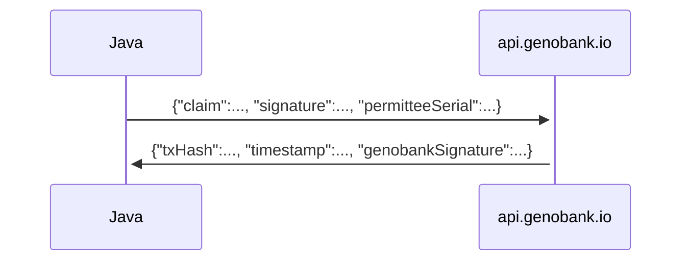

# Blockchain Lab Results Certification

This project demonstrates how to notarize one lab result certification on the blockchain with GenoBank.io. This is written in Java and is portable to Apache Tomcat, command line and other web environments.




## Prerequisites

1. Supported operating systems are macOS, Linux and Windows
2. Install Java (version 11 or later supported version) and Apache Maven
   - On macOS
     1. [Do not use](https://stackoverflow.com/a/28635465/300224) the official installer from Oracle, that approach is painful, nobody uses it
     2. [Install Homebrew](https://brew.sh)
     3. `brew install java`
     4. `brew install maven`
     5. `brew install openjdk`

## Downloading

Get the latest source code from GitHub

```sh
cd ~
mkdir -p Developer
cd Developer
git clone https://github.com/Genobank/genobankj.git
cd genobankj
```

## Building and testing

Prepare your Maven project build state

```sh
./mvnw initialize
```

Build the product

```sh
./mvnw clean compile assembly:single
```

A build which passes all tests will be indicated by:

> [INFO] BUILD SUCCESS

at the bottom of your build.

After you have made any changes, run the build command above.

Run the product without arguments to see instructions

```sh
java -jar target/*.jar --test
```

Or include all required parameters to notarize a certificate

```sh
java -jar target/*.jar --test 'wrong outside clever wagon father insane boy junk punch duck drift cupboard' 41 'Bob' '1234' '1' 'N' '' 1614069145429
```

(Test account at https://github.com/Genobank/genobank.io/wiki/Test-Accounts-and-Certificates)

## Overview

* `LaboratoryProcedure`, `LaboratoryProcedureResult`, `Network` are simple records.
* `PermitteeRepresentations` stores everything that the permittee (laboratory) will attest to.
* `PermitteeSigner` performs cryptographic signing on behalf of the permittee.
* `Platform` notarizes the certificate onto the blockchain using GenoBank.io.
* `NotarizedCertificate` is the notarized artifact.
* `Main` is the program entry point.

## Extending

You are welcome to extend the functionality of this example, for example to connect to an ERP system or add additional information (like birthday) into the name field.

## References

* Style, comments
  * Baseline code style guide from https://google.github.io/styleguide/javaguide.html
  * Oracle style guide for doc comments https://www.oracle.com/technetwork/java/javase/documentation/index-137868.html#styleguide
    * What words to capitalize (refer examples), when to use periods and full sentences
    * ["Include tags in the following order"](https://www.oracle.com/technetwork/java/javase/documentation/index-137868.html#orderoftags)
    * Align text to columns
* Which version of dependencies we should support
  * Java versions supported by vendor https://www.oracle.com/technetwork/java/java-se-support-roadmap.html

- Setting up a Java + Maven + JUnit project layout
  - Best practice for Java+Maven+JUnit project layout https://github.com/junit-team/junit5-samples/tree/master/junit5-jupiter-starter-maven
  - How to remove Maven initialization errors https://stackoverflow.com/questions/4123044/maven-3-warnings-about-build-plugins-plugin-version
  - Gitignore for Maven projects ("should I include jars?") https://github.com/fulldecent/aion-aip040/issues/25
  - How to package everything into one Jar file https://stackoverflow.com/a/574650/300224
- Gitignore from https://github.com/github/gitignore/blob/master/Maven.gitignore
- Editorconfig is included and some rules are referenced to Google Java Style Guide

## Maintenance

- Periodically update to the most recent version, to obtain the latest bug fixes and new features:

  ```sh
  ./mvnw versions:use-latest-versions -Dincludes="org.checkerframework:*"
  ```

  

* Periodically update mvnw if necessary. We recognize upstream as https://github.com/takari/maven-wrapper

## License

This project is assigned copyright to GenoBank.io. All rights reserved.
